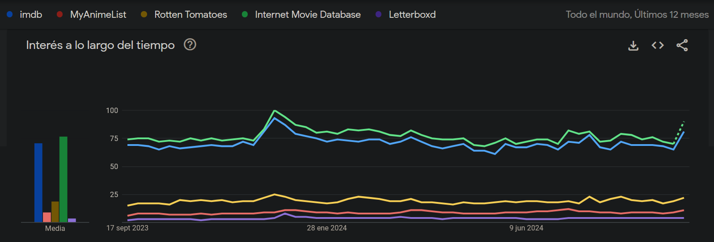
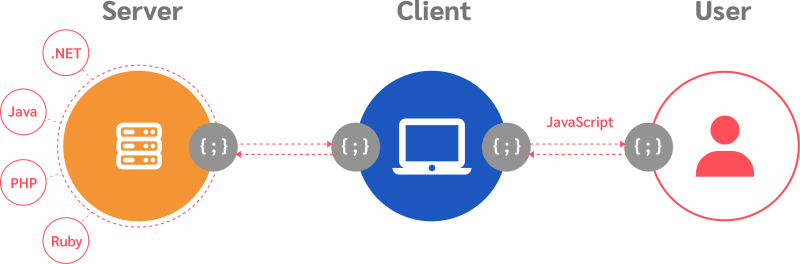
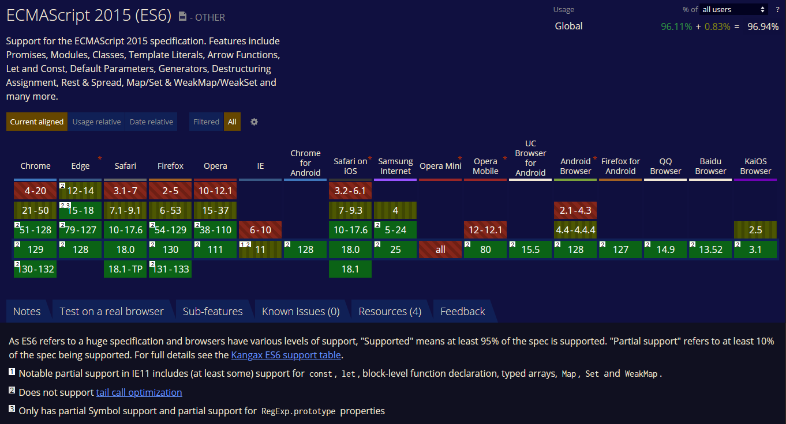

# dwec24-25
# Proyecto 1: Propuesta inicial de aplicación web

## Índice:
### 1.1 Idea de la aplicación
### 1.2 Audiencia objetivo
### 1.3 Análisis de mercado
### 1.4 Funcionalidades clave
### 1.5 Modelos de ejecución (c.e. 1a)
### 1.6 Lenguajes de programación web (c.e. 1c, 1d)
### 1.7 Tecnologías a utilizar
### 1.8 Compatibilidad en navegadores (c.e. 1b)

### 1.9 Bibliografía

## 1.1 Idea de la aplicación:

- Nombre elegido: MySeriesList

- La aplicación consiste en una red social de películas y series enfocada principalmente al seguimiento personal de contenido audiovisual, a la recomendación personalizada en base al perfil y la posibilidad de socializar con clubes, sorteos y campeonatos pero con una interfaz renovada y más práctica para el usuario.

## 1.2 Público objetivo:

- La aplicación estará diseñada para personas de casi todas las edades (entre 14 y 65 años) que quieran disfrutar de contenido audiovisual y quiera llevar un control del consumo o seguir la actualidad. También cuenta con un público objetivo secundario, los creadores que busquen potenciar su contenido sin un gran desembolso de dinero.

- Tiene una gran relevancia debido a que no existe una opción igual que tenga las mismas funcionalidades de seguimiento, red social y recomendaciones con una intefaz de usuario (UI) intuitiva. Hay opciones similares como 'Letterboxd' pero la finalidad es diferente.

- Se dispone de multitud de beneficios, entre otros, **es un servicio completamente gratuíto**, gracias a la publicidad y las personas que busquen una version premium con ventajas y sin publicidad o tener gran facilidad para preguntar por recomendaciones.

| **Beneficios**                      | **Descripción**                                                                                   |
|-------------------------------------|---------------------------------------------------------------------------------------------------|
| **Ahorro de tiempo**     | Permite que un usuario que utiliza 'MySeriesList' activamente ahorre gran cantidad de tiempo gracias a la comodidad. |
| **Recomendaciones personalizadas**  | El perfil del usuario es usado para crear recomendaciones en función a lo que se ha visto o se quiere ver. |
| **Control de novedades**            | Recibe una notificación personalizada para lanzamientos para no dejar escapar ni el lanzamiento menos conocido. |
| **Componente social**               | Refuerza los gustos del usuario uniendo personas con gustos similares.
| **Publicidad para creadores**       | Los creadores no necesitan gastar grandes sumas de dinero. Potencia mucho los lanzamientos independientes. |

## 1.3 Análisis de mercado:

- Este paso será un proceso de investigación en el que analizaremos el mercado al que pertenece nuestra futura aplicación para recopilar información sobre consumo, competencia, etc.

- Las páginas como IMDb, The Movie Database, Rotten Tomatoes o Metacritic son actualmente famosas y muy usadas en términos de recomendación, pero sin ofrecer los beneficios personalizados para los usuarios que ofrece MyAnimeList. En cambio, se centran más en críticas de expertos o no tienen interfaces de usuario tan amigables. 

- Esta gráfica refleja la popularidad de la competencia abierta a series y cine mundial frente al nicho del anime y la popularidad que podría tener una idea bien ejecutada.

## 1.4 Funcionalidades clave:

- La funcionalidades principales de la aplicación son varias y se pueden enumerar de la siguiente manera:

| **Funcionalidad clave**             | **Descripción**                                                                                   |
|-------------------------------------|---------------------------------------------------------------------------------------------------|
| **Registro e identificación**       | Permite al usuario crear una cuenta usando credenciales.                                          | 
| **OAuth**                           | Facilita al usuario el registro y la autenticación vinculandolo con Google oFacebook entre otros. |
| **Seguimiento de progreso**         | Permite a los usuarios registrar y llevar un control detallado de las series y películas vistas.  |
| **Bases de datos profunda**         | No se limita a series y películas, sino que se expande a distribuidoras, artistas y otros miembros del sector como actores de doblaje |
| **Críticas por episodios controladas** | Las críticas de episodios se desbloquean una vez el usuario haya visto el episodio, evitando spoilers a personas que no ven contenido en su lanzamiento. |
| **Reseñas generales**               | Sección para críticas generales de la serie o película completa, enfocadas en impresiones sin spoilers. |
| **Foros y discusiones temáticas**   | Espacios organizados para discutir teorías, temas y comentarios generales, con hilos claramente marcados si contienen spoilers. |
| **Filtros y búsqueda**              | Herramientas avanzadas que permiten al usuario encontrar lo deseado en una gran base de datos.    |
| **Rankings personalizados**         | Ofrece rankings basados en las preferencias y el historial de cada usuario para recomendaciones más ajustadas. |
| **Actualidad y recomendaciones**    | Sugiere series y películas basadas en el historial de visualización y calificaciones del usuario y personaliza el seguimiento de la actualidad. |
| **Eventos y votaciones**            | Crea eventos como votaciones por temporadas con premios y sorteos.                                |
| **Privacidad y seguimiento**        | Configura la visibilidad del perfil y el seguimiento de perfiles como amigos o artistas, etc.     |

## 1.5 Modelos de ejecución:
- Los modelos de ejecución se refieren a dónde se ejecuta el código de la aplicación. Esta decisión afecta en su rendimiento, seguridad o la escalabilidad.
- Un modelo de ejecución puede ser en cliente o en servidor. Esto no implica que uno sea mejor que otro, sin embargo, debemos elegir adecuadamente según nuestras necesidades.

| **Característica**                  | **Ejecución en cliente**                    | **Ejecución en servidor**                           |
|:------------------------------------|:--------------------------------------------|-----------------------------------------------------|
| **Rendimiento** | Dependerá del dispositivo usado por el usuario | Dependerá de la capacidad del servidor y la cantidad de usuarios que gestione |
| **Seguridad** | El código generalmente está visible y se puede alterar | El código está más seguro en el servidor                       |
| **Interactividad** | Experiencia de uso fluida | Lentitud y tiempos de espera más elevados                                              |
| **Escalabilidad** | No | Según demanda de servicio, la escalabilidad puede ser automática                                               |
| **Dependencia de red** | Baja, no es necesario comunicación en todas las interacciones | Alta, ya que en cada interacción deberá comunicarse con el servidor |
| **Uso de recursos** | Altos recursos locales, bajos recursos de red | Altos recursos de red, bajos recursos locales                     |

## 1.6 Lenguajes de programación web

- Los lenguajes de programación web que usaremos son variados, con diferentes finalidades.

### Lenguajes del lado cliente

**Javascript:**
- Es un lenguaje de programación diseñado para crear contenido dinámico e interactivo. Es fundamental junto con HTML y CSS.
- Se usa generalmente para manipular el DOM (Document Object Model), validar formularios, y permitir que la web responda al usuario sin necesidad de recargar la página.
- Cuenta con multitud de bibliotecas y frameworks, como React, Angular o Vue que aceleran el desarrollo y con una de las comunidades más grandes de desarrolladores, facilitando la resolución de problemas.

**TypeScript**
- Es un superconjunto de JavaScript y dota al lenguaje de características extra que evitan errores, lo hacen más sencillo y coherente.
- Algunas de sus ventajas son: Detección de errores en tiempo de compilación o autocompletado más preciso. Es mejor para desarrollos a gran escala.
- Sus desventajas son: Añade un paso adicional al flujo de trabajo debido a la transpilación que se debe hacer a JavaScript o que es más dificil de aprender.

### Lenguajes del lado servidor

**Java:**
- Es un lenguaje de programación de propósitos generales y se usa en el desarrollo de aplicaciones web, de escritorio, móviles, etc. Se usa principalmente en backend para gestión de datos y lógica empresarial.
- Fue diseñado para ser seguro y con la capacidad de ejecutarse en múltiples plataformas usando la JVM (Java Virtual Machine).
- Es portable, robusto, seguro y cuenta con un ecosistema maduro que facilitan mucho el desarrollo.

**PHP:**
- Es un lenguaje de scripting y se usa principalmente para controlar formularios, sesiones, cookies y acceso a base de datos.
- Es fácil de aprender y tiene una documentación buena y robusta.
- Es muy popular y tiene una excelente compatibilidad con bases de datos.

## 1.7 Tecnologías a utilizar

**React:**
- React es una librería para construir interfaces de usuario. Es de código abierto y puede usarse para desarrollar SPA (Single Page Application), móviles o SSR (Server-Side Rendered) por ejemplo.

**Vue:**
- También es un framework de JavaScript, y un ecosistema que cubre la mayoría de las características que se necesitan en el desarrollo front-end.
- Está diseñado para ser flexible y escalable con la estructura adecuada, con una curva de aprendizaje suave.

- En el diagrama anterior podemos ver el uso de tecnologías web y el entorno al que pertenecen. En el lado del servidor tenemos lenguajes de programación como .NET, Java, PHP o Ruby y el usuario hace uso del navegador con JavaScript para interactuar con la interfaz de usuario y comunicarse con el servidor. 

## 1.8 Compatibilidad entre navegadores

- Como podemos comprobar en la siguiente imagen, el uso de Javascript está soportado por la mayoría de las versiones de los navegadores actuales desde aproximadamente 2016. Esto lo hace una excelente opcion para crear una página web, exceptuando Internet Explorer (actualmente en desuso) y opera mini, que tiene una arquitectura de diseño específica que puede afectar a su soporte para JavaScript.

## 1.9 Bibliografía

### General
- https://chat.openai.com

### 1.1
- https://myanimelist.net/
### 1.3
- https://trends.google.com, https://www.imdb.com/, https://www.rottentomatoes.com/, https://www.metacritic.com/
### 1.6
- https://developer.mozilla.org/en-US/docs/Web/JavaScript
- https://es.wikipedia.org/wiki/JavaScript
- https://www.php.net/
- https://es.wikipedia.org/wiki/PHP
### 1.7
- https://www.orientsoftware.com/technologies/web-technologies/
- https://digital55.com/blog/que-son-single-page-application-spa-desarrollo-elegido-por-gmail-linkedin/
- https://vuejs.org/guide/introduction.html
### 1.8
- https://caniuse.com/?search=ECMAScript
